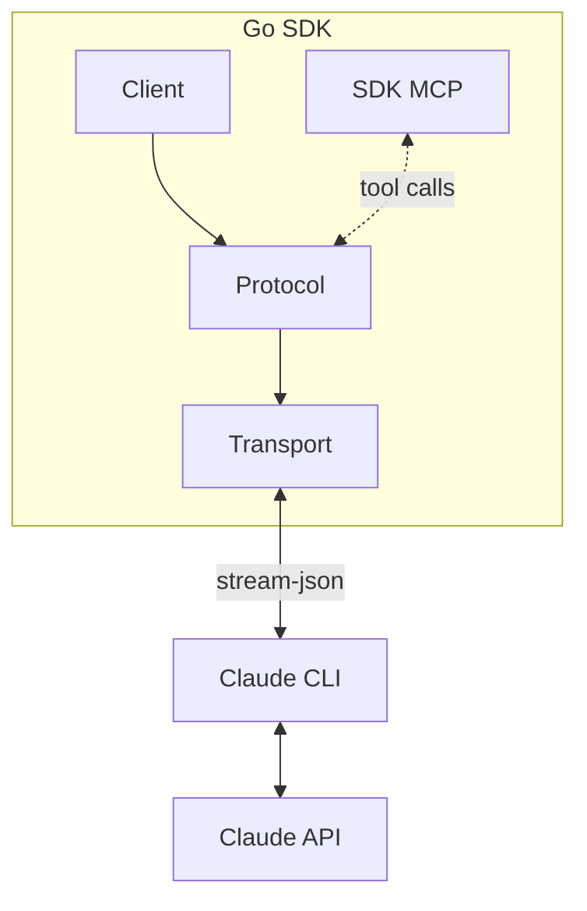
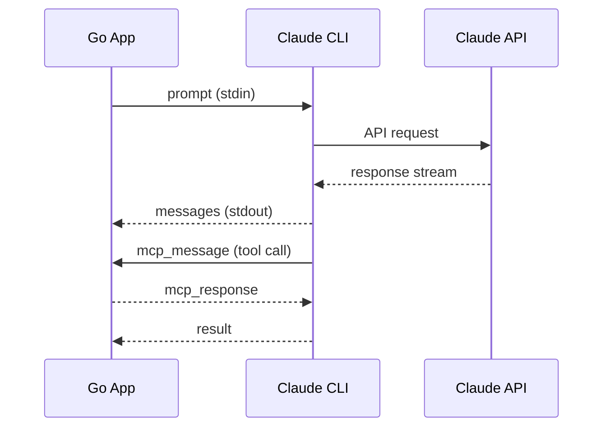

# claude-agent-sdk-go

[](LICENSE)

A pure Go SDK for Claude's agentic capabilities.

## Overview

claude-agent-sdk-go provides a native Go interface to Claude Code by managing
the CLI as a subprocess. It communicates via line-delimited JSON over
stdin/stdout, giving you access to Claude's tool use, extended thinking,
session management, and hook system.

This repository tracks the official TypeScript Agent SDK surface through the
v0.3.263 catchup work, using Go idioms where the API shape differs.



When you call `Query()` or `Stream()`, the SDK spawns the CLI, sends your
prompt, and yields messages as they arrive. For MCP tools, the flow includes
bidirectional control messages:



## Installation

```bash
go get github.com/tylergannon/claude-agent-sdk-go
```

Requirements:
- Go 1.23+ (for `iter.Seq`)
- Claude Code CLI: `npm install -g @anthropic-ai/claude-code`
- `ANTHROPIC_API_KEY` or `CLAUDE_CODE_OAUTH_TOKEN` in your environment

## Quick Start

```go
package main

import (
    "context"
    "fmt"
    "log"

    "github.com/tylergannon/claude-agent-sdk-go"
)

func main() {
    client, err := claudeagent.NewClient(
        claudeagent.WithSystemPrompt("You are a helpful assistant."),
    )
    if err != nil {
        log.Fatal(err)
    }
    defer client.Close()

    ctx := context.Background()
    for msg := range client.Query(ctx, "What is the capital of France?") {
        switch m := msg.(type) {
        case claudeagent.AssistantMessage:
            fmt.Println(m.ContentText())
        case claudeagent.ResultMessage:
            fmt.Printf("Cost: $%.4f\n", m.TotalCostUSD)
        }
    }
}
```

## Streaming

For multi-turn conversations:

```go
stream, _ := client.Stream(ctx)
defer stream.Close()

stream.Send(ctx, "Let's plan a trip to Japan.")

for msg := range stream.Messages() {
    if m, ok := msg.(claudeagent.AssistantMessage); ok {
        fmt.Println(m.ContentText())
    }
}

// Continue the conversation
stream.Send(ctx, "What about Kyoto?")
```

## Configuration

```go
client, _ := claudeagent.NewClient(
    claudeagent.WithModel("claude-sonnet-4-5-20250929"),
    claudeagent.WithSystemPrompt("You are an expert Go developer."),
    claudeagent.WithPermissionMode(claudeagent.PermissionModeAcceptEdits),
    claudeagent.WithMaxTurns(20),
)
```

Settings can be supplied either as a settings file path or as inline JSON:

```go
client, _ := claudeagent.NewClient(
    claudeagent.WithSettingsPath("/path/to/settings.json"),
)

client, _ = claudeagent.NewClient(
    claudeagent.WithSettings(claudeagent.Settings{
        Model: "claude-sonnet-4-5-20250929",
        Permissions: &claudeagent.SettingsPermissions{
            Allow: []string{"Bash(git status)"},
        },
    }),
)
```

## Custom Tools (MCP)

Define tools that Claude can use during conversations:

```go
type AddArgs struct {
    A int `json:"a"`
    B int `json:"b"`
}

server := claudeagent.CreateMcpServer(claudeagent.McpServerOptions{
    Name: "calculator",
    Tools: []claudeagent.ToolRegistrar{
        claudeagent.Tool("add", "Add two numbers",
            func(ctx context.Context, args AddArgs) (claudeagent.ToolResult, error) {
                return claudeagent.TextResult(fmt.Sprintf("%d", args.A+args.B)), nil
            },
        ),
    },
})

client, _ := claudeagent.NewClient(
    claudeagent.WithMcpServer("calculator", server),
)
```

See [MCP Tools](docs/examples/mcp-tools.md) for typed responses, binary servers, and more.

## Ralph Wiggum Loop

For complex iterative tasks, use the Ralph Wiggum loop. Claude works on a task
repeatedly, seeing its previous work each iteration, until it outputs a
completion signal:

```go
loop := claudeagent.NewRalphLoop(claudeagent.RalphConfig{
    Task:              "Implement a Redis cache layer with tests",
    CompletionPromise: "TASK COMPLETE",
    MaxIterations:     10,
})

for iter := range loop.Run(ctx, claudeagent.WithModel("claude-sonnet-4-5-20250929")) {
    fmt.Printf("Iteration %d\n", iter.Number)
    if iter.Complete {
        fmt.Println("Task completed!")
        break
    }
}

fmt.Printf("Total cost: $%.4f\n", loop.TotalCost())
```

The loop intercepts session exit via a Stop hook and reinjects the task prompt
if the completion promise (`<promise>TASK COMPLETE</promise>`) hasn't been
detected. See [Ralph Loop](docs/examples/ralph.md) for details.

## Documentation

For detailed guides and examples, see [docs/examples/](docs/examples/):

- [MCP Tools](docs/examples/mcp-tools.md) - Integrate custom tools via Model Context Protocol
- [Hooks](docs/examples/hooks.md) - Intercept and modify Claude's execution
- [Subagents](docs/examples/subagents.md) - Define and monitor specialized agents
- [Questions](docs/examples/questions.md) - Handle interactive questions from Claude
- [Sessions](docs/examples/sessions.md) - Persist and resume conversations
- [Permissions](docs/examples/permissions.md) - Control what Claude can do
- [Streaming](docs/examples/streaming.md) - Real-time response handling
- [Skills](docs/examples/skills.md) - Filesystem-based capability extensions
- [Ralph Loop](docs/examples/ralph.md) - Iterative task completion pattern
- [Task Lists](docs/TASKS.md) - Multi-agent task coordination system

## TypeScript SDK Parity

The SDK tracks the upstream TypeScript Agent SDK release cadence. Coverage
landed across a series of catchup cycles, one per upstream release picked up.

The v0.2.119 catchup added:

- thinking effort, task budgets, debug files, extra CLI args, agent selection,
  and prompt/agent progress toggles
- programmatic subagents, richer hook inputs/outputs, permission updates, and
  MCP HTTP/SSE configuration
- stream control and introspection helpers, runtime MCP server updates,
  file/read-state/plugin control, and local JSONL session helpers
- explicit settings support via `WithSettingsPath`, `WithSettings`, and
  `WithManagedSettings`

The v0.3.150 catchup added:

- per-server MCP `Timeout` and `AlwaysLoad` knobs across Stdio/HTTP/SSE/proxy
  configurations
- background-tasks control protocol (`Query.BackgroundTasks`) plus
  `BackgroundTaskSummary` and `SessionCronSummary` payloads on `Stop` /
  `SessionEnd` hooks
- new `system/permission_denied` message subtype, `SDKAssistantMessage.Error`
  enum (incl. `oauth_org_not_allowed`, `model_not_found`), `ResultMessage`
  TTFT + origin metadata, and `MemoryRecallEntry` `organization` scope
- hook output additions: `UpdatedToolOutput` on `PostToolUse`,
  `TerminalSequence` OSC notifications, `SuppressOriginalPrompt` on
  `UserPromptSubmit`, plus per-hook `Args` (no-shell exec form) and
  `ContinueOnBlock`
- managed-org / sandbox / worktree / marketplace settings batch covering
  `PolicyHelper`, `DisableAgentView`, `IsolatePeerMachines`,
  `Sandbox.TLSTerminate`, `Worktree.BaseRef`, `StatusLine.HideVimModeIndicator`,
  marketplace `skills-dir` / `unsupported` source variants, and others
- `read_file` `Encoding` (utf-8 / base64), `applyFlagSettings` per-key null
  clearing, host-side `host_auth_token_refresh` and `submit_feedback` control
  subtypes

The v0.3.168 catchup added:

- new system message subtypes (`ThinkingTokensMessage`, `CommandsChangedMessage`),
  the `MessageDisplay` hook event, and the `MessageOriginKindAutoContinuation`
  origin variant
- `ResultMessage` timing fields (`Duration*MS`), an `Overloaded`
  `SDKAssistantMessage.Error` variant, and the `SessionTitle` field on
  `SessionStart` + `UserPromptSubmit` hook inputs
- hook output additions: `ReloadSkills` on `SessionStart` and
  `AdditionalContext` on `Notification` / `PostToolBatch` / `PostToolUse*` /
  `PreToolUse` / `SessionStart` / `Setup` / `Stop` / `SubagentStart` /
  `SubagentStop` / `UserPromptExpansion` / `UserPromptSubmit`
- new control RPCs: `OnUserDialog` callback for `request_user_dialog`,
  `Stream.ReloadSkills`, and `Stream.RegisterRepoRoot` with
  `WithReloadClaudeMD` / `WithReloadPlugins` / `WithReloadSkills`
- managed-settings batch: `RequiredMinimumVersion`, `RequiredMaximumVersion`,
  `SwitchModelsOnFlag`, `ForceLoginMethod` `"gateway"`, `Settings.FallbackModel`
  list, `PluginSuggestionMarketplaces`, marketplace `SkipLfs`, plus
  `Workflows` / `EnableWorkflows` / `WorkflowKeywordTriggerEnabled` /
  `Ultracode` knobs
- correctness fixes: `pending_permission_requests` round-trips on control
  success payloads, marketplace source variants document `skipLfs` flow, and
  `Effort` / strict-MCP docstrings refreshed for clarity

PRs in this cycle (squash-merged): #96 MessageDisplay hook, #97
ThinkingTokensMessage, #98 SessionStart reloadSkills, #99 SessionTitle hook
fields, #100 workflows + ultracode + pluginSuggestionMarketplaces, #101
marketplace skipLfs, #102 option docstring refresh, #103
pending_permission_requests round-trip, #104 CommandsChangedMessage, #105
Stop/SubagentStop additionalContext, #106 OnUserDialog + request_user_dialog,
#107 reload_skills RPC, #108 register_repo_root + Stream.RegisterRepoRoot,
#109 overloaded assistant error, #110 MessageOriginKindAutoContinuation,
#111 ResultMessage timing fields, #112 Settings.FallbackModel list, #113
managed required/maximum version + switchModelsOnFlag + forceLoginMethod
"gateway".

The v0.3.177 catchup added:

- the `ModelRefusalFallbackMessage` system subtype (`model_refusal_fallback`)
  and `AssistantMessage.Supersedes` — the refusal-fallback supersede/retract
  signals emitted when a refused turn is retried on a fallback model
- the experimental `get_usage` control request (`Stream.GetUsageExperimental`)
  returning session cost/usage totals, claude.ai plan rate-limit windows, and
  local-transcript behavioral attribution
- `Options.SupportedDialogKinds` (+ `WithSupportedDialogKinds`) plumbed into
  the initialize request, rejected at init without `OnUserDialog`
- `pending_user_dialog_requests` on control responses,
  `MCPServerToolPolicy.OrgMaxPermission`, `PluginConfig.SkipMcpDiscovery`, and
  `RateLimitInfo.OverageInUse`
- managed Settings parity: `EnforceAvailableModels`, `DisableBundledSkills`,
  `DisableArtifact`, `FooterLinksRegexes`, `WheelScrollAccelerationEnabled`

PRs in this cycle (squash-merged): #116 model_refusal_fallback + supersedes,
#117 get_usage control request, #118 SupportedDialogKinds, #119
pending_user_dialog_requests, #120 OrgMaxPermission, #121 SkipMcpDiscovery,
#122 OverageInUse, #123 Settings parity.

The v0.3.185 catchup added:

- two new system message subtypes: `WorkerShuttingDownMessage`
  (`worker_shutting_down`, a live-tail-only graceful-teardown signal) and
  `InformationalMessage` (`informational`, a leveled text banner for hook
  feedback / slash-command output)
- `thinking_display` on `set_max_thinking_tokens`: `SetMaxThinkingTokens` now
  takes optional `WithThinkingDisplay` / `WithThinkingDisplayAPIDefault`,
  modeling the omit / value / explicit-null wire states
- the optional `ExitWaiter` transport capability (`WaitForExit`), implemented
  by `SubprocessTransport` and kept off the core `Transport` interface
- new fields: `RateLimitInfo` credit-exhaustion (`ErrorCode`,
  `CanUserPurchaseCredits`, `HasChargeableSavedPaymentMethod`),
  `ResultMessage.TimeOriginMs`, `UserMessage.SenderTaskID`
- Settings parity: `Settings.DisableClaudeAiConnectors`,
  `SettingsAttribution.SessionURL`, `SettingsSandbox.AllowAppleEvents`

PRs in this cycle (squash-merged): #126 worker_shutting_down, #129
informational, #130 thinking_display, #131 RateLimitInfo credit fields, #132
ResultMessage time_origin_ms, #133 UserMessage senderTaskId, #127 Settings
parity, #128 transport WaitForExit, #134 docs refresh.

The v0.3.195 catchup added:

- `Stream.SetMcpPermissionModeOverride` — the
  `set_mcp_permission_mode_override` control request (deferred in v0.3.185 for
  want of a wire shape) now ships upstream. Pins or clears a tighten-only
  per-MCP-server permission-mode override; the `mode` argument is a tristate
  (`default` / `auto` / nil-clears, the last serialized as explicit JSON null)
  and the result carries an optional typo-detection `warning`
- `Stream.Reinitialize` — re-sends the `initialize` control request to a
  running CLI (past the cached first-connect result), so a client reattaching
  after a transport gap has blocked `can_use_tool` / `request_user_dialog`
  requests redelivered
- the `ModelRefusalNoFallbackMessage` system subtype
  (`model_refusal_no_fallback`), emitted when a turn refuses with no fallback
  model configured, plus `RefusedUserMessageUUID` on
  `ModelRefusalFallbackMessage` (the rewind/edit-and-retry target)
- `SettingsSandbox.Credentials` — credential-file / env-var `deny` protection
  for sandboxed commands
- Settings parity: `RespondToBashCommands`, `DisableSideloadFlags`, and
  `teammateMode: iterm2`
- additive enum/usage parity: `RateLimitType` `seven_day_overage_included`,
  `TerminalReason` `background_requested`, and `UsageRateLimits.ModelScoped`
  (per-model weekly windows on the `get_usage` response)

PRs in this cycle (squash-merged): #136 SetMcpPermissionModeOverride, #138
Reinitialize, #139 model_refusal_no_fallback, #141 RefusedUserMessageUUID, #137
sandbox credentials, #140 Settings parity, #142 usage/enum parity, #143 docs
refresh.

The v0.3.201 catchup added:

- `AgentDefinition.Observer` / `ObserverMessage` — an agent type auto-spawned as
  a read-only background observer whenever the agent runs, plus a supplemental
  postamble appended to each activity digest sent to it
- two `MessageOrigin` provenance kinds: `observer` (a message injected by a
  background observer agent, carrying `SenderTaskID`) and `observer-activity`
  (an activity digest routed to the observer)
- `BaseHookInput.PromptID` — the `prompt_id` UUID correlating a user prompt with
  all subsequent events (also emitted as the OpenTelemetry `prompt.id`
  attribute), so hook output can be joined to OTel events at prompt grain
- `ModelInfo.ResolvedModel` — the canonical wire model id an alias catalog row
  resolves to (e.g. `sonnet` → `claude-sonnet-5`)
- sandbox credential `mask` mode: `SettingsSandboxCredentialEnvVar` gains
  `mask` (sentinel-in-sandbox, real value injected at the proxy) alongside
  `deny`, plus `InjectHosts` to narrow substitution and
  `SettingsSandboxCredentials.AllowPlaintextInject` for the plain-HTTP path
- `PermissionContext.RequiresUserInteraction` — parsed from
  `requires_user_interaction` on the inbound permission request; true when the
  tool's approval card is itself the interaction surface (hosts must not offer a
  one-tap allow/deny)
- Settings parity: `EnableArtifact` and `AskUserQuestionTimeout`
  (`60s`/`5m`/`10m`/`never`)

PRs in this cycle (squash-merged): #148 AgentDefinition observer fields, #146
observer message-origin kinds, #149 BaseHookInput prompt_id, #147
ModelInfo resolvedModel, #150 sandbox credential mask mode, #151 permission
requires_user_interaction, #152 Settings parity, #153 docs refresh.

Deferred this cycle (no observable wire shape or a non-mechanical port):

- Out-of-band permission responses — the TS `CanUseTool` gained a
  `PermissionResult | null` return plus a `requestId` and the
  `Transport.expectControlResponse` / `Query.awaitControlResponse` pair, letting
  a consumer answer a permission request out-of-band and have the SDK skip its
  own transport write. Go's `CanUseTool` returns a `PermissionResult` with no
  clean `null` analogue, and the feature needs a transport-interface contract
  change; deferred to a dedicated design pass rather than forced into this cycle.
- Type-only control-request union members (`list_models`, `get_workspace_diff`,
  `get_plan`, `set_cwd`) and message union members (`control_request_progress`,
  `conversation_reset`, `active_goal`) — added to the upstream unions but their
  struct bodies are unexported and absent from the shipped runtime, so there is
  nothing to model yet. Deferred until the wire shape is observable.
- The `sdk-tools.d.ts` tool-schema surface (`ReportFindings`, `ClaudeDesign`,
  `Projects` `present_to_user`, and friends) — the Go SDK models a curated
  subset of common tool inputs, not the full tool-schema catalog.

The v0.3.207 catchup added:

- `ActiveGoalMessage` — the top-level `active_goal` message reporting the
  `/goal` Stop hook state; `Value` is nil when the goal is cleared, otherwise
  carries the condition plus iteration/reason bookkeeping. Concretized upstream
  from the type-only member deferred in v0.3.201.
- `ConversationResetMessage` — the top-level `conversation_reset` message
  emitted by `/clear`, plan-mode exit, and fresh-session flows, carrying the
  `NewConversationID` to mount a fresh transcript under. Also concretized from
  the v0.3.201 type-only member.
- `ControlRequestProgressMessage` — the `system`/`control_request_progress`
  message for a long-running client-originated control request, correlated by
  `RequestID`; retry counters are pointers, populated only for the `api_retry`
  status. Concretized from the v0.3.201 type-only member.
- `BackgroundTasksChangedMessage` — the `system`/`background_tasks_changed`
  message carrying the full live background-task set on every membership change
  (REPLACE semantics, a level signal rather than a task_started/notification
  edge, reset per CLI process)
- `SystemMessage.Capabilities` — the optional `capabilities` string array on
  `system`/`init` for feature-detecting protocol behavior instead of
  version-sniffing (open set; `interrupt_receipt_v1` is the first value)
- interrupt receipt — `Stream.InterruptWithReceipt` returns the
  `InterruptReceipt.StillQueued` uuids of async user messages that survive the
  interrupt, on CLIs advertising `interrupt_receipt_v1`; `Stream.Interrupt`
  stays as the fire-and-forget wrapper (no breaking signature change)
- six new `TerminalReason` values: `api_error`,
  `malformed_tool_use_exhausted`, `budget_exhausted`,
  `structured_output_retry_exhausted`, `tool_deferred_unavailable`,
  `turn_setup_failed`
- `MessageOrigin.Body` — the decoded peer-envelope body (byte-exact with what
  the model sees), set only for the `peer` origin kind
- `SessionMessage.ParentAgentID` — the agentId of the subagent that spawned a
  subagent transcript message, nil for depth-1 subagents, the main session, or
  older metadata

PRs in this cycle (squash-merged): #155 active_goal, #156
background_tasks_changed, #157 control_request_progress, #158 conversation_reset,
#159 init capabilities, #160 interrupt receipt, #161 TerminalReason values, #162
MessageOrigin peer body, #163 SessionMessage parent_agent_id.

Deferred this cycle (Go models no matching surface):

- `mcp_call` staging (`input_files`/`output_files`/`expires_at`/`timeout_ms` on
  the mcp_call control request) — the Go SDK implements no outbound `mcp_call`
  control request.
- Tool input/output schema churn: `ScheduleWakeup`'s `stop`/optional fields,
  `Artifact`'s `action`/`favicon`/list mode, `EnterWorktree`, `ExitPlanMode`
  permissions deprecation, and the `ArtifactOutput` type — none of these tools
  are in the curated tool-input subset.
- Assistant-message `usage` API sub-fields (`citations`, widened
  `service_tier`, `inference_geo`, `speed`, `iterations`) — the Go `Usage`
  struct is a simplified projection; the raw API usage is opaque.

Not ported earlier cycles: `listSessions`' `includeProgrammatic` filter — a
local-filesystem session-picker option whose sibling `includeWorktrees` the Go
`ListSessions` never mirrored, and `SDKSessionInfo` carries no entrypoint field
to filter on. The `rewind_conversation` and `add_directory` control-request
union members ship without an exported wire body or a public Query method, so
there is nothing to model yet — both deferred until upstream exposes them.

The v0.3.215 catchup added:

- `APIProviderAnthropicGoogleCloud` — the `anthropicGoogleCloud` value on the
  `apiProvider` account enum (the Anthropic-managed Google Cloud backend).
- `AssistantMessage` wrapper fields `ResumedFromIncompleteThinking` (this turn
  continued a truncated signed-thinking block; must survive a bridge replay),
  `Aborted` (truncated by an interrupt before `stop_reason`), and `Timestamp`
  (per-message ISO completion time, display-only — not an ordering key).
- `PluginInfo.Version` — the plugin's `plugin.json` manifest version, on both
  the `reload_plugins` response and the `initialize` system message
  (plugin-author-controlled; validate before trusting).
- Permission-request `PermissionContext.SuppressAlwaysAllowRule` (omit any
  persistent "don't ask again" affordance) and `MatchedAskRule` (a user ask
  rule forced the prompt while it still carries the tool's own decision reason;
  render-unsafe, sanitize before display).
- `MessageOrigin.Subkind` — `scheduled-trigger` on the `task-notification`
  origin kind, marking a delivery that is the fired stored prompt of a
  scheduled task/routine.
- `ToolProgressMessage` fields `Heartbeat`, `SubagentType`, and `SubagentRetry`
  (`{agent_id, attempt, max_retries, retry_delay_ms, error_status,
  error_category}`; `error_status` is nil for connection errors).
- `UserPromptSubmitInput.Source` (who authored/injected the prompt; trial-gated
  to Anthropic-internal sessions) and the `fork` value on the `SessionStart`
  hook source.
- `Settings` fields `ProcessWrapper` (corporate launcher argv prefix),
  `FeedbackDrafts` (`notify`/`quiet`/`off` for the SendFeedback tool), and
  `VimInsertModeRemaps` (vim INSERT-mode two-char remaps to `<Esc>`).

PRs in this cycle (squash-merged): #168 anthropicGoogleCloud, #169 assistant
wrapper fields, #170 PluginInfo version, #171 permission ask-rule fields, #172
MessageOrigin scheduled-trigger, #174 tool_progress subagent fields, #173 hook
input source, #175 settings parity, plus this docs refresh.

Deferred this cycle (Go models no matching surface):

- New tool schemas `RefreshMcpTools`, `SendFeedback`, and `ProposeSkills`, plus
  tool input/output field churn (`Artifact` `scope`/`title`, `Bash`
  `timedOutAfterMs`/`backgroundCwdHint`, `Task` `modelsUsed`, and friends) —
  none are in the curated tool-input subset.
- The alpha usage/policy prefix constants (`ORG_POLICY_LIMIT_PREFIXES`,
  `USAGE_LIMIT_ERROR_PREFIXES`, `USAGE_TRANSITION_PREFIXES`,
  `USAGE_WARNING_PREFIXES`) — runtime string arrays with no wire type; the Go
  `Usage` struct is a simplified projection.
- `signalCode` on the process-exit transport type — a Node `ChildProcess`
  detail; the Go transport models exit differently.
- `set_max_thinking_tokens`' `max_thinking_tokens` becoming optional and the
  `effortLevel: 'max'` session-scoped value — already representable in Go
  (`SetMaxThinkingTokens` takes a nil-able `*int`; `EffortLevel` is a string
  alias), so no struct change.
- Upstream doc-only text (docs.anthropic.com → platform.claude.com /
  code.claude.com link migrations, the `setMcpServers` plugin-exemption note,
  and the `mcp_call` on-demand server bring-up note).

The v0.3.220 catchup added:

- `FastModeDisabledReason` — the enum explaining why fast mode declined a turn
  (`free`, `preference`, `extra_usage_disabled`, `network_error`, `unknown`,
  `not_first_party`, `disabled_by_env`, `model_not_allowed`,
  `sdk_opt_in_required`, `pending`), added everywhere `fast_mode_state` already
  lives: `SDKControlInitializeResponse`, `ResultMessage`, `SystemMessage`.
- `ModelInfo` pricing fields `CanonicalModel` (the canonical id used for the
  pricing lookup, e.g. `claude-opus-4-7`) and `Provider` (the API provider that
  served the model).
- `MessageOrigin` peer fields `FromSession` (the sender's host-openable session
  id, a UI navigation target) and `VerifiedPeerPid` (the kernel-verified pid of
  the connecting process — the field to key sender identity on, not the
  forgeable `From`).
- `ResultMessage` success fields `UserMessageUUID` (uuid of the user message
  that drove the turn) and `RequestSentWallMs` (wall-clock send time, ms).
- `RewindFilesResult.SkippedLinks` — tracked files not restored/deleted because
  a symlink, hard link, or other non-regular file was detected (real rewinds
  only).
- The `DirectoryAdded` hook event and `DirectoryAddedInput` (`Directory`,
  `Source` = `slash_command`/`register_repo_root`), fired when a directory is
  registered as a working-directory root.
- `Stream.InterruptCancelQueued` plus `InterruptReceipt.Cancelled` and the
  `interrupt_cancel_queued_v1` capability — an interrupt that also cancels
  queued/pending-dispatch commands rather than leaving them to run.
- Sandbox settings `SettingsSandboxNetwork.StrictAllowlist` (deterministically
  deny hosts not in `allowedDomains`) and `SettingsSandboxFilesystem.Disabled`
  (skip filesystem isolation while keeping network + seccomp isolation).
- `Settings` fields `WorkflowSizeGuideline` (advisory dynamic-workflow size),
  `EmojiCompletionEnabled` (`:emoji:` typeahead), `PrecomputeCompactionEnabled`
  (precompute the compaction summary in the background), and `VoiceEnabled`
  (hold-to-talk dictation).

PRs in this cycle (squash-merged): #179 fast_mode_disabled_reason, #180
ModelInfo pricing fields, #181 peer origin provenance, #182 result timing
fields, #183 rewind skippedLinks, #184 DirectoryAdded hook, #185 interrupt
cancel_queued, #186 sandbox strictAllowlist/disabled, #187 settings parity,
plus this docs refresh.

Deferred in that cycle (Go models no matching surface):

- `sdk-tools.d.ts` churn (e.g. `liveSubscription` on a tool output) — not in the
  curated tool-input subset, the same standing deferral as prior cycles.
- The `"bubble"` permission mode removed from one `sdk-tools` mode enum — the Go
  SDK never modeled `bubble`, so no change.
- `set_model`'s `model` becoming nullable (`null`/`'default'` resets to the
  session default) — already representable: `SetModel` sends `"default"` (or
  omits the field).
- `bridge.d.ts` browser-bridge callbacks (`onRenameSession` /the `rename_session`
  request, `onPermissionResponse` returning a boolean) — TS-internal browser
  bridge, not the wire/control protocol the Go SDK models.
- Upstream doc-only comment rewordings (supportedCommands push tracking, skills
  canonical-name matching, add_directory strict-subdirectory + duplicate-denied,
  mtime "integer milliseconds" phrasing, AgentToolCompletedOutput, force-
  overwrite upsert).

The v0.3.226 catchup added:

- `SessionOptions.ResumeDropsTurn` + `WithResumeDropsTurn` — the fork-point guard
  for a truncating `ResumeSessionAt` resume. It names the prompt UUID of the turn
  being discarded, and the CLI refuses the resume when anything else (a queued
  user message, a task notification absorbed mid-turn) falls in the discarded
  range. The refusal is a deterministic `error_during_execution` result prefixed
  `Resume rejected by --resume-drops-turn:` — route it to rewind-recovery, not a
  retry.
- `MessageOriginKindUnclassified` and `MessageOriginSubkindPeerSendMessage` — the
  latter marks a coordinator co-member `SendMessage` delivery, which carries
  task-notification prompt authority but stays distinguishable so the new
  `CrossSessionInbound` setting can apply to it.
- `ModelRefusalFallbackMessage.Scope` (`session` / `local`) — whether the fallback
  swapped the session model or only served one subagent, side-question, or
  background-fork response. Absent from older CLIs; empty means `session`.
- Structured sandbox credential masking: `mask` mode on `credentials.files` plus
  `Extract`, `OnExtractNoMatch`, `Decode: "jwt"`, `MaskClaims` on files and env
  vars, `MaskDuplicates` and `InjectHosts` on files.
- Sandbox credential SigV4 re-signing: `AWSPairs` (explicit key-id/secret/session
  groupings for non-standard variable names) and `SigV4` policies (`deny` by
  default, or `passthrough`) for the streaming, presigned, and SigV4A shapes the
  proxy cannot re-sign.
- `Settings` fields `DialogExpiry` (how long a remote-forwarded dialog or a HELD
  cross-session message stays parked before resolving to its safe default) and
  `CrossSessionInbound` (`accept` / `hold` / `refuse` for inbound peer
  `SendMessage`; unset means permission-mode-class parity, not accept).
- `SettingsMarketplaceSourceArchive` — zip-archive plugin sources (`url`, optional
  `sha256` that pins the download and doubles as version identity), plus the
  `error` string on `unsupported` sources and the `owner/*` wildcard that github
  entries may use in the managed-settings policy lists and nowhere else.

PRs in this cycle (squash-merged): #190 resumeDropsTurn, #191 origin
unclassified/peer-send-message, #192 refusal fallback scope, #193 credential
masking, #194 credential SigV4, #195 settings parity, #196 archive marketplace
source, plus this docs refresh.

Deferred this cycle (Go models no matching surface, or needs a design call):

- `OnElicitation` / `OnUserDialog` out-of-band responses — both callbacks now
  receive the control envelope's `requestId` and may return `null` to suppress
  the SDK's own `control_response` because the consumer already answered the
  request out of band. Same transport-contract family as the `canUseTool` null
  path deferred in v0.3.201, and `requestId` on its own is useless without the
  suppression channel, so this needs an API design call (sentinel error vs. a
  third return value) rather than a mechanical port.
- `bridge.d.ts` failure classification (`CredentialsRejection` /
  `isCredentialsRejection`, `CreateSessionFailure.reason`, the `request_rejected`
  and `malformed_response` terminal reasons) — browser bridge, not the
  wire/control protocol the Go SDK models.
- `sdk-tools.d.ts` churn (`Feedback` gaining `failure_mode` / `task_category`,
  `RemoteTrigger` gaining `create_webhook_trigger`) — neither tool is in the
  curated `tool_inputs.go` subset, the standing deferral.
- Zod-internal schema plumbing (`ZodPipe<ZodTransform<…>>` wrappers on the
  sandbox credential arrays, widened `bwrapPath` / `socatPath` transform input) —
  TS-side validation machinery with no wire change.
- Upstream reformatting: `import * as z` and the single-quote rewrite of
  `EXIT_REASONS`, `HOOK_EVENTS`, `ORG_POLICY_LIMIT_PREFIXES`, and the `USAGE_*`
  prefix arrays. No value changed.

One pre-existing divergence surfaced while diffing this release and is left as
follow-up work: with no `OnUserDialog` registered, the Go SDK answers a
`request_user_dialog` with `cancelled`, while the TS SDK has stayed silent since
at least v0.3.220 so a renderer-bearing client or the worker's park deadline can
settle it. v0.3.226 only reworded the doc comment to match the behavior it
already had.

The v0.3.233 catchup added:

- `AssistantMessage.ContextUsage` — the structured twin of the `/context` report,
  riding as a wrapper-level sibling on the synthetic assistant message that
  delivers the markdown table, so it is never replayed to the model. This is a
  separate wire shape from `SDKControlGetContextUsageResponse`, which mirrors the
  camelCase `/context` control response: the new one is snake_case, deliberately
  smaller, and upstream commits to evolving it additively. Category rows and the
  over-limit reason get named kinds (`ContextUsageUsed` / `Free` / `Buffer` /
  `Deferred`, `ContextWindowHardLimit` / `Compaction`); classify rows on the kind,
  never on the display name.
- `SystemMessage.TerminalSlashCommands` — the subset of `SlashCommands` whose UX
  is bound to the local terminal (`exit`, `statusline`). Remote UIs should hide
  these; empty means either an older CLI or an untagged session, and showing
  everything is the right fallback for both.
- `SettingsMarketplaceSourceCommand` — plugin sources whose directory is produced
  by running a marketplace-declared command that prints one absolute path
  (`command`, optional `timeout`, `mode: "copy"` / `"link"`). Under `link` the
  cache points at that directory in place, so it must stay valid for the life of
  the process and a changed path is the only signal of new content. Gated by the
  managed-settings-only `DisableCommandPluginSources`, which follows
  `AllowManagedHooksOnly` when unset.
- `Settings.AdditionalMarketplaces` / `AllowedMarketplaces` — aliases read exactly
  as `ExtraKnownMarketplaces` / `StrictKnownMarketplaces`. Prefer the canonical
  spellings while older clients share the same settings file: they ignore the
  alias outright, and an allowlist that silently isn't there means unrestricted.
  The SDK does not fold aliases into the canonical fields, since resolving that
  conflict is the CLI's job.
- `Settings.ForceLoginGatewayURL` — the Cloud gateway URL to pre-fill and
  auto-connect to alongside `ForceLoginMethod: "gateway"`. Admin-controlled
  managed settings only.
- `queued_notifications` on `SystemMessage.Capabilities` — the CLI accepts inbound
  `queued_notification` stream messages and drains them via `ReadNotifications`.
  Doc-only here: `Capabilities` is already an open `[]string`, and the drain tool
  sits outside the curated `tool_inputs.go` subset.

PRs in that cycle (squash-merged): #200 assistant `context_usage`, #201
`terminal_slash_commands`, #202 command plugin source, #203 marketplace settings
aliases, #204 `forceLoginGatewayUrl`, plus its docs refresh.

Deferred in v0.3.233:

- `sdk-tools.d.ts` churn (`ReadNotifications` and `ProposeGoal` tools,
  `RemoteTrigger` gaining `list_runs` / `get_run_log`, `Bash` gaining
  `backgroundEndsWithFinalResponse`, the commit `branch` field,
  `output_tokens_details.thinking_tokens`) — outside the curated
  `tool_inputs.go` subset, the standing deferral.
- `bridge.d.ts` close codes 4093 (presence heartbeats failing while SSE stays
  healthy) and 4094 (worker credential expired on the request path), plus the
  `isCreateSessionFailure` narrowing — browser bridge, no Go surface.
- The `attribution` index signature — Go already ignores unknown keys on decode,
  so an extras map would only add round-trip ambiguity to the public API.
- A `ripgrep` settings doc reword: it is honored only from user, managed/policy,
  or CLI (`--settings`) settings, and ignored from project settings. Behavior
  the Go SDK does not model either way.

The v0.3.241 catchup added:

- `SystemMessage.Effort` — the effort level the session will send on its next
  request, after env overrides, session state, org caps and model-support
  downgrades. A genuine tri-state, so it is a `NullableEffortLevel` value tagged
  `omitzero` rather than a pointer: an explicit `null` means no effort parameter
  will be sent at all, while an absent key means the host does not publish the
  field. A pointer cannot carry that distinction, because `encoding/json`
  resolves a `null` into a nil pointer without ever calling `UnmarshalJSON`.
- `TaskStartedMessage.IsBackgrounded` / `SpawnDepth` — whether a task was
  registered in the background or in the foreground with the spawning tool call
  blocking on it, and the nesting depth of a spawned subagent. `task_started`
  reports registration state only; a later move to the background arrives as
  `TaskUpdatePatch.IsBackgrounded`.
- `MessageOrigin.FromMode` — the *sending* session's permission class on a peer
  origin (`PeerFromModeBypass` / `Prompting`). An absent value means hold, not a
  default class: a recipient that runs without asking delivers same-class
  messages immediately and holds cross-class or undeclared senders.
- `MessageOriginSubkindProjectsRelay` — a Claude Code Projects delivery composed
  server-side for a project coordinator and addressed to one of its thread
  sessions. Framed as a coordinator message only when it carries the server's
  relay stamps; one without them keeps the generic background-notification frame.
- `AssistantMessageErrorAccountOnHold`, plus constants naming the four live
  `apiKeySource` values (`ANTHROPIC_API_KEY`, `apiKeyHelper`, `/login managed
  key`, `none`). The field stays a plain `string` — it is an open set. Upstream's
  five legacy members get no constants: current CLIs never emit them.
- `HookJSONOutput.ClassifierContext` — host-asserted context shown to the
  auto-mode permission classifier alongside a PostToolUse result. Capped at 2000
  UTF-16 code units shared across all hooks on one call, honored on synchronous
  responses only, and unused on calls the classifier transcript omits. Pair an
  assertion with the rewrite it describes in the same hook result, but never
  return an identity rewrite to achieve that pairing — hooks run in parallel on
  the original output and it would compete last-write-wins with a real redaction.
- `SuppressOriginalPrompt` on `UserPromptExpansion` — the field is declared on
  the expansion hook's output too, with identical semantics. The response builder
  now names the hook that produced the envelope instead of hardcoding
  `UserPromptSubmit`.
- `poll_event` on `UserPromptSubmitInput.Source` — doc-only; both hook-input
  builders already map `source`. It is the one source where a blocking verdict
  rejects something not yet delivered: the hook fires at enqueue time, before the
  event's delivery ack exists.
- `SDKControlInitializeResponse.HooksApplied` — whether a repeated initialize's
  hooks replaced the registered set, or were ignored because another client
  configured the session. Nil is not false: a CLI predating the field ignored
  hooks on every repeated initialize without saying so.
- `Settings.SyncClaudeAiSkills`, `Worktree.Location`, `KeybindingFlavor`,
  `AutoContinueAtUsageLimit`, `ModelSettings`, `Spellcheck`. Only `false` is
  honored for `SyncClaudeAiSkills`, so it is a `*bool`. `Worktree.Location` is
  desktop-only — the CLI does not read it for `--worktree`, `EnterWorktree`, or
  agent isolation. A per-model persisted effort tops out at `xhigh`, where the
  init message's applied effort also admits `max`.
- `SettingsMarketplaceSourceURL`, plus `headersHelper` documented on url sources
  and `headers`/`headersHelper` on inline catalog entries. Both already ride the
  open source map. The two helpers differ in lifetime: a url source's is re-run
  on every marketplace refresh and runs from the Claude config home (so relative
  paths do not resolve where a caller expects), while a catalog entry's runs only
  on explicit install or update.

PRs in this cycle (squash-merged): #207 init `effort`, #208 `task_started`
backgrounding, #209 peer `fromMode` and `projects-relay`, #210 `account_on_hold`
and `apiKeySource` constants, #211 `classifierContext`, #212 prompt-hook parity,
#213 `hooks_applied`, #214 Settings parity, #215 marketplace `headersHelper`,
plus this docs refresh.

Deferred in v0.3.241:

- `sdk-tools.d.ts` churn (the Artifact/read/watch tool input unions) — outside
  the curated `tool_inputs.go` subset, the standing deferral.
- `bridge.d.ts`: the `onStopTask` callback, and the terminal-reason split where
  `request_rejected` gains `status` and an origin `source`, and
  `malformed_response` becomes its own variant. No Go bridge transport exists.
- `ExitReason` / `EXIT_REASONS` lost `bypass_permissions_disabled`, and
  `SDKControlGetPlanRequest` / `SDKControlGetWorkspaceDiffRequest` were deleted
  outright (gone from `sdk.mjs` too). The Go SDK never modeled either surface, so
  both removals are no-ops here.

The v0.3.251 catchup added:

- `PreModelSwitch` / `PostModelSwitch` hooks — the first new hook pair since
  `DirectoryAdded`, and the first hook input to carry prompt-cache economics.
  Only `PreModelSwitch` is vetoable, which is why `source` differs between them:
  the post phase adds `auto` and `resume`, switches the CLI initiates itself and
  so never offers for approval.
- Per-server `timeout` on SDK MCP servers, in milliseconds. Values under 1000ms
  are ignored, and changing it on an already-registered server does nothing
  until the server is removed and re-added.
- `ModelUsage.CostBasis` (plus `CanonicalModel` and `Provider`, which predate it
  and were never modeled) — which price table the most recent request was priced
  at. Empty until this process has priced a request for the model, which a
  `--resume` makes common; read that as list pricing.
- `PerTaskStopAffordance` on the initialize request.
- `UserMessageUUID` on every first reply frame, plus `QueuedTurnCount` on
  results so a host draining a send queue can tell "this run is done" from "more
  is inbound".
- The `Ambient` marker on task frames, which covers every `SkipTranscript` task
  and more.
- `DefaultToNo` on permission asks.
- SessionStart resume-cost fields, so a host can price a resume before
  committing to it.
- Settings: `PromptCacheTTL`, `SubagentPromptCacheTTL`,
  `DesktopSessionCleanupPeriodDays`, `SyncClaudeAiPlugins`,
  `ManagedSourcesBehavior`, `SpinnerTipsOverride`, plus the model picker and
  contracted-rate pricing.

PRs in this cycle (squash-merged): #218 model-switch hooks, #219 SDK MCP
per-server timeout, #220 pricing provenance, #221 `perTaskStopAffordance`,
#222 `user_message_uuid`, #223 queued-turn count, #224 ambient marker,
#225 `default_to_no`, #226 SessionStart resume pricing, #228 Settings parity,
#229 model picker and pricing.

The v0.3.263 catchup added:

- Plugin delivery over the initialize request. `pluginDelivery: 'initialize'`
  moves the plugin list off the command line and into the initialize payload,
  because Windows refuses a command line past 32,767 characters and one
  `--plugin-dir` per plugin blows through it. `'argv'` remains the Go default:
  `initialize` needs Claude Code 2.1.261+, and an older binary exits at startup
  on the unknown `--await-initialize` option rather than degrading.
- `PermissionPrompts` — lets a session declare it has no approval surface.
- System prompt `snapshot`, a genuine tri-state: omitted records a bare preset,
  `false` never records. Plus sending a preset system prompt's `append`.
- `update_settings` and `reload_output_styles` control requests — the first new
  control subtypes since `get_settings` — and options on `get_context_usage` and
  `get_usage`.
- `SDKMcpResourceLink` and `ResourceLinks` on task notifications. A backgrounded
  MCP task's `tool_result` is placeholder text and its real result arrives as the
  notification, so this is the only place a host learns which files the call
  produced.
- `UserMessageUUIDs` on reply, result and thinking frames. `UserMessageUUID`
  alone turned out to be insufficient: when the host merges several
  close-together sends into one turn it names only the last member, leaving
  every other sender unable to recognize the reply. The result list can be
  strictly longer than the reply list, because queued messages fold into a
  running turn between tool rounds.
- The first-frame result timings — `FirstContentFrameMs`, `FirstStreamPostMs`,
  `FirstStreamPostAckMs`, `FirstStreamPostWallMs`. Success results only.
- `NoResponse` on `api_retry`. Its presence, not its durations, is the point:
  for a first-byte timeout `MaxRetries` is that cause's own cap — normally a
  single retry — rather than the session's retry budget.
- `ModelUsage.ThinkingTokens`, already counted inside `OutputTokens` so summing
  the two double-counts. It tallies only turns run on a CLI recording the field,
  which makes it partial for a session resumed across versions and unsafe as a
  denominator.
- Settings: `Permissions.BlockReadsOutsideWorkingDirectories` (nested in the
  permissions block), `ManagedMCPServers`, `BashOutputMaxChars`,
  `TaskOutputMaxChars`, `TimeFormat` and `TimeZone`. `TimeFormat` is an open
  string type rather than an enum because upstream unions the four presets with
  any strftime pattern containing `%`.

PRs in this cycle (squash-merged): #231/#232 plugin delivery, #233
`permissionPrompts`, #234/#235 system prompt append and snapshot, #236
`update_settings`, #237 `reload_output_styles`, #238 control-request options,
#239 `resource_links`, #240 `user_message_uuids`, #241 first-frame timings,
#242 `no_response`, #243 `thinkingTokens`, #244 Settings parity, plus this docs
refresh.

Deferred in v0.3.251 and v0.3.263:

- `bridge.d.ts` `onSetModel` (`notices` and a `Promise` return) — no Go bridge
  transport exists. Deferred every cycle since v0.3.233.
- `sdk-tools.d.ts` schema churn — the standing deferral since v0.3.207.
- The `spinnerTipsOverride.tips` union element — breaking, outbound-only, and
  with no decode consumer to justify it.
- The prompt word-editing keys setting, which upstream now documents as having
  no effect. The Go field stays: removing it is a breaking change for no gain.

Some areas remain intentionally limited by the CLI or integration harness:
desktop/IDE-only settings are not modeled exhaustively, several runtime control
paths have unit coverage plus skipped integration slots until stable live CLI
fixtures exist, and alpha task/agent behavior should still be checked against
the installed Claude Code CLI version.

### Porting from the TypeScript SDK - Go-side differences

A short list of places the Go SDK consciously diverges from the TS shape; if
you are translating TS code, watch for these:

- **`Options.Env` merges, it does not replace.** TS `Options.env` REPLACES the
  subprocess environment entirely; the Go `Options.Env` is overlaid on top of
  `os.Environ()`. If you relied on the TS replace-semantics, clear inherited
  variables yourself before spawning. There is no opt-in flag for replace mode.
- **Cancellation is `context.Context`, not `AbortSignal`.** TS forwards a
  derived `AbortSignal` that fires only after a stdin-EOF + grace window. In Go,
  that grace window lives inside `SubprocessTransport.Close()`: the SDK closes
  stdin, waits up to 5 seconds for the CLI to exit on its own, and only then
  force-kills. Anything you hang off the same `context.Context` (HTTP
  cancellation, in-flight tool teardown) inherits the same ordering guarantee.
- **`'Skill'` in `AllowedTools` is deprecated upstream.** Per TS SDK v0.3.150,
  passing `'Skill'` in `AllowedTools` or `AgentDefinition.Tools` is deprecated.
  Use `AgentDefinition.Skills` for per-agent preload. The Go SDK does not
  currently expose the upstream top-level user-facing `skills` option; the
  existing `Options.Skills` mirrors the control-init system-prompt loading
  allowlist, which is a different surface.
- **`Effort` `"max"` / `"xhigh"` are model-gated.** `EffortMax` requires Opus
  4.6/4.7 or Sonnet 4.6; `EffortXHigh` requires Opus 4.7. On unsupported
  models the CLI silently downgrades per its own policy. The CLI is the
  authority on which model accepts which level - the SDK only forwards the enum
  value.
- **`OnUserDialog` answers cancelled by default, including on unknown
  `dialogKind`.** Per TS SDK v0.3.168, `dialogKind` is an open string union: a
  new CLI release can ship a kind the host has never seen. The contract is
  that the host MUST respond cancelled in that case, and the CLI then applies
  the dialog's default behavior. The Go SDK enforces this automatically: if
  `OnUserDialog` is unset, or the callback returns a non-nil error, the SDK
  emits cancelled on the host's behalf. Callbacks that do recognize the kind
  should still return `UserDialogBehaviorCancelled` (rather than fabricating a
  result) for any branch they cannot honor — a misbehaving host should never
  wedge the CLI on an unresolved dialog. As of TS SDK v0.3.177, declare the
  kinds the host can actually render via `Options.SupportedDialogKinds`: the
  CLI fails closed and never emits an undeclared kind, so the flow behind it
  degrades to its no-dialog behavior instead.

For internal architecture, see [DESIGN.md](docs/DESIGN.md). For CLI protocol
details (how this and the official Typescript SDK actually work), see
[cli-protocol.md](docs/cli-protocol.md).

## Testing

```bash
go test ./...
```

## License

[MIT](LICENSE)
